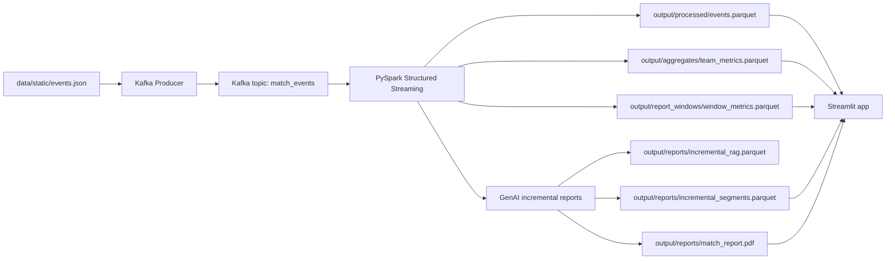

# Arquitectura del proyecto

Este proyecto simula una arquitectura de analitica deportiva en tiempo real para un partido de futbol. El sistema parte de eventos StatsBomb almacenados en JSON, los publica en Kafka como si llegaran durante el partido, los procesa con PySpark Structured Streaming, persiste snapshots en Parquet y los muestra en una app Streamlit. Sobre esos artefactos tambien se genera narrativa incremental con agentes, RAG y un LLM local via Ollama.

## Vista general

## Nodo: Kafka

Kafka actua como bus de eventos entre el productor y el pipeline de streaming.

En Docker se levanta con la imagen `apache/kafka:4.1.1` en modo KRaft, sin Zookeeper. Tiene dos listeners:

- `kafka:29092`: listener interno usado por contenedores.
- `localhost:9092`: listener externo usado desde la maquina host.

El topic principal es `match_events`. El compose permite autocreacion de topics con `KAFKA_AUTO_CREATE_TOPICS_ENABLE=true`, por lo que el productor puede publicar directamente sin crear el topic manualmente.

## Nodo: Kafka Producer

Archivo principal: `src/kafka_producer.py`.

Su funcion es convertir un fichero estatico StatsBomb en una fuente de eventos casi real-time. No publica todos los eventos crudos: primero carga, ordena, filtra y normaliza el feed.

Responsabilidades:

- Lee `data/static/events.json` o la ruta configurada en `DATA_PATH`.
- Ordena los eventos por el campo `index` para conservar la cronologia del partido.
- Filtra solo eventos utiles para el analisis: `Pressure`, `Duel`, `Interception`, `Block`, `Clearance`, `Pass`, `Shot`, `Carry` y `Dribble`.
- Aplana cada evento a un esquema comun: `event_id`, `timestamp`, `match_id`, `team`, `player`, `event_type`, `zone`, `minute`, `second`, `outcome`, `value`, `period`.
- Calcula la zona del campo en una matriz 3x3 usando coordenadas StatsBomb.
- Normaliza resultados:
  - tiros: `GOAL`, `ON_TARGET`, `BLOCKED`, `OFF_TARGET`, `UNKNOWN`;
  - acciones binarias: `SUCCESS` o `FAIL`.
- Infere presiones exitosas si hay recuperacion del mismo equipo dentro de una ventana de 5 segundos o mediante eventos relacionados.
- Asigna `value`: tiros valen mas segun impacto; acciones binarias valen 1 si son exitosas y 0 si fallan.
- Publica a Kafka en lotes de `EVENT_BATCH_SIZE`, con pausa aleatoria entre `MIN_SLEEP_SECONDS` y `MAX_SLEEP_SECONDS`.

Variables relevantes:

- `KAFKA_BROKER`: broker destino. Por defecto `localhost:9092`; en Docker `kafka:29092`.
- `DATA_PATH`: fichero de eventos.
- `MATCH_ID`: identificador del partido.
- `EVENT_BATCH_SIZE`: tamano del lote simulado.
- `MIN_SLEEP_SECONDS` y `MAX_SLEEP_SECONDS`: latencia simulada entre lotes.

## Nodo: Streaming pipeline

Archivo principal: `src/streaming_pipeline.py`.

Este nodo consume eventos de Kafka usando PySpark Structured Streaming. Procesa microbatches, mantiene un store en memoria de eventos vistos y cada cierto intervalo escribe snapshots consolidados en Parquet.

Responsabilidades:

- Crea una `SparkSession` local con conector Kafka compatible con la version de PySpark instalada.
- Lee del topic `match_events` desde `startingOffsets=earliest`.
- Parsea el JSON del mensaje Kafka con un esquema estricto.
- Filtra registros invalidos sin `event_id` o sin equipo/jugador util.
- En cada microbatch:
  - anade eventos nuevos al store en memoria `_live_events_by_id`;
  - elimina duplicados por `event_id`;
  - cada `SNAPSHOT_INTERVAL_SECONDS` persiste artefactos consolidados.
- Escribe un unico fichero Parquet por salida, sustituyendo el snapshot anterior para simplificar el consumo por Streamlit.
- Calcula metricas acumuladas por equipo.
- Calcula metricas por ventanas de partido de `REPORT_WINDOW_MINUTES`.
- Detecta ventanas cerradas y dispara generacion incremental de texto.
- Refresca el PDF final cuando se generan nuevos segmentos.

Salidas principales:

- `output/processed/events.parquet`: eventos limpios acumulados.
- `output/aggregates/team_metrics.parquet`: historico de snapshots acumulados por equipo.
- `output/report_windows/window_metrics.parquet`: metricas por ventanas de partido.
- `output/checkpoints/snapshots`: checkpoint de Spark Structured Streaming.
- `output/reports/incremental_rag.parquet`: documentos RAG generados por ventana.
- `output/reports/incremental_segments.parquet`: textos narrativos generados.
- `output/reports/match_report.pdf`: informe PDF compuesto desde artefactos ya persistidos.

Metricas calculadas:

- volumen de eventos;
- goles, tiros, pases, conducciones, regates, presiones, duelos, intercepciones, bloqueos y despejes;
- pases exitosos y porcentaje de exito;
- duelos ganados y porcentaje de exito;
- indice ofensivo;
- indice defensivo;
- valor medio del evento.

## Nodo: Streamlit app

Archivo principal: `src/app.py`.

Streamlit es la capa de visualizacion. No consume Kafka directamente y no invoca el LLM. Solo lee ficheros Parquet y PDF generados previamente por el pipeline.

Responsabilidades:

- Lee `events.parquet`, `team_metrics.parquet`, `window_metrics.parquet`, `incremental_segments.parquet` y `match_report.pdf`.
- Muestra estado de readiness de cada artefacto.
- Refresca la pantalla cada 30 segundos si `streamlit-autorefresh` esta disponible.
- Presenta eventos recientes y KPIs basicos del partido.
- Dibuja distribucion de eventos por equipo y tipo.
- Presenta comparativas acumuladas por equipo.
- Muestra evolucion por ventanas: eventos, indices ofensivos/defensivos y tipos de evento.
- Lista ventanas abiertas, pendientes y generadas.
- Expone los textos incrementales con trazabilidad del flujo GenAI.
- Permite descargar el PDF si ya existe.

Pestanas principales:

- `Eventos`: tabla y resumen de eventos limpios.
- `Metricas por equipo`: comparativa acumulada y evolucion.
- `Informe incremental`: estado de ventanas y textos generados.
- `Exportar informe`: descarga del PDF.
- `Estado`: rutas leidas y estado de artefactos.

## Nodo: GenAI y reporting

Los componentes GenAI viven principalmente en:

- `src/incremental_report.py`
- `src/graph_workflow.py`
- `src/tools.py`
- `src/rag_pipeline.py`
- `src/report_generator.py`

El pipeline de streaming llama a `generate_missing_report_segments()` cuando hay ventanas cerradas. Esa funcion construye documentos RAG incrementales, ejecuta un workflow de agentes y guarda el texto resultante. Despues `report_generator.py` compone un PDF con metricas, graficos y textos ya persistidos.

El LLM configurado por defecto es Ollama con `llama3.2`. Si Ollama falla o no devuelve texto valido, el sistema guarda un fallback determinista para no bloquear el informe.

## Contenedores Docker

El `docker-compose.yml` define cuatro servicios:

- `kafka`: broker Kafka en KRaft.
- `producer`: ejecuta `python src/kafka_producer.py`.
- `streaming`: ejecuta `python src/streaming_pipeline.py` con Java y PySpark.
- `dashboard`: ejecuta `streamlit run src/app.py` y expone `http://localhost:8501`.

Cada servicio Python usa un fichero de requisitos separado:

- `docker/requirements-producer.txt`
- `docker/requirements-streaming.txt`
- `docker/requirements-dashboard.txt`

Esto mantiene imagenes mas ligeras y evita instalar dependencias de LLM o Spark en servicios que no las necesitan.
