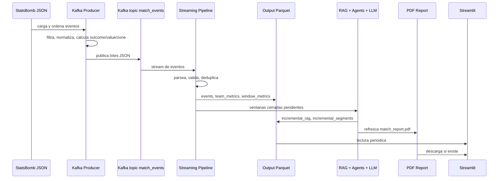

# Flujo de datos

Este documento se centra en el recorrido de los datos desde el JSON inicial hasta la visualizacion en Streamlit y la generacion de informes.

## Resumen rapido



## 1. Entrada de datos

La fuente inicial es:

```text
data/static/events.json
```

El fichero contiene eventos StatsBomb con estructura anidada. El proyecto no los usa directamente en la app. Primero pasan por el productor Kafka, que los convierte a un esquema plano y mas estable para streaming.

Tambien existen ficheros de apoyo:

- `data/static/match.json`
- `data/static/teams.json`
- `data/docs/rag_corpus/*.md`

Los dos primeros aportan contexto estatico del partido/equipos si se quiere extender el proyecto. El corpus Markdown alimenta el RAG documental.

## 2. Preprocesado en el Kafka Producer

Archivo:

```text
src/kafka_producer.py
```

El productor hace estas transformaciones antes de publicar:

### 2.1 Carga y ordenacion

Lee el JSON con `load_and_sort_events()` y ordena por `index`. Esto conserva la secuencia del partido.

### 2.2 Filtrado de tipos

Solo publica eventos considerados relevantes para las metricas:

- `Pressure`
- `Duel`
- `Interception`
- `Block`
- `Clearance`
- `Pass`
- `Shot`
- `Carry`
- `Dribble`

### 2.3 Aplanado de esquema

Cada evento queda en este formato:

```text
event_id
timestamp
match_id
team
player
event_type
zone
minute
second
outcome
value
period
```

Este esquema es el contrato entre productor y pipeline Spark.

### 2.4 Calculo de zona

`derive_zone()` divide el campo StatsBomb 120x80 en tres tercios horizontales y tres verticales. Devuelve etiquetas como:

```text
defensive_left
middle_center
attacking_right
```

Si faltan coordenadas, devuelve `unknown`.

### 2.5 Normalizacion de outcome

Para tiros:

- `Goal` -> `GOAL`
- `Saved` o `Saved to Post` -> `ON_TARGET`
- `Blocked` -> `BLOCKED`
- `Off T`, `Wayward`, `Post` -> `OFF_TARGET`
- otro caso -> `UNKNOWN`

Para eventos binarios:

- pases sin outcome nativo -> `SUCCESS`;
- pases con outcome -> `FAIL`;
- regates completos -> `SUCCESS`;
- duelos/intercepciones ganados -> `SUCCESS`;
- carries relacionados con `Dispossessed` o `Miscontrol` -> `FAIL`;
- presiones exitosas si hay recuperacion posterior o relacionada del mismo equipo.

### 2.6 Calculo de value

`compute_event_value()` asigna:

- gol: 3;
- tiro a puerta: 2;
- otro tiro: 1;
- accion binaria exitosa: 1;
- accion binaria fallida: 0.

### 2.7 Publicacion simulada

Los eventos se envian al topic:

```text
match_events
```

No se publican todos de golpe. Se usan lotes de `EVENT_BATCH_SIZE` y pausas aleatorias para simular llegada real-time.

## 3. Transporte en Kafka

Kafka desacopla productor y consumidor.

El productor solo necesita saber donde publicar. Spark puede arrancar antes o despues, y consume desde `startingOffsets=earliest`, por lo que puede leer eventos ya publicados desde el principio del topic.

En Docker:

- productor y streaming usan `kafka:29092`;
- clientes desde host usan `localhost:9092`.

## 4. Procesamiento en streaming

Archivo:

```text
src/streaming_pipeline.py
```

Spark lee mensajes Kafka y ejecuta un `foreachBatch`, lo que permite usar logica batch sobre cada microbatch.

### 4.1 Lectura Kafka

Spark crea un stream:

```text
format("kafka")
subscribe = match_events
startingOffsets = earliest
```

El valor Kafka se castea a string y se parsea como JSON.

### 4.2 Validacion

El pipeline descarta filas:

- sin `event_id`;
- con `team == Unknown` y `player == Unknown`.

### 4.3 Buffer en memoria

Cada microbatch se colecta y se guarda en:

```python
_live_events_by_id
```

La clave es `event_id`. Esto permite deduplicar y mantener una vision acumulada del partido.

### 4.4 Snapshots temporizados

No escribe Parquet en cada microbatch. Solo publica snapshots si se cumple:

```text
now - last_snapshot >= SNAPSHOT_INTERVAL_SECONDS
```

Por defecto, son 30 segundos.

### 4.5 Persistencia de eventos limpios

Spark escribe:

```text
output/processed/events.parquet
```

Contiene eventos acumulados, deduplicados y enriquecidos con:

- `snapshot_time`
- `batch_id`

El proyecto escribe un unico fichero fisico Parquet para que pandas/Streamlit lo lean de forma sencilla.

### 4.6 Persistencia de metricas acumuladas

Spark calcula `summarize_team_metrics()` agrupando por equipo.

Salida:

```text
output/aggregates/team_metrics.parquet
```

Este fichero mantiene historico de snapshots. Cada snapshot agrega filas nuevas por equipo, con:

- metricas acumuladas;
- `snapshot_time`;
- `batch_id`;
- `snapshot_event_count`.

### 4.7 Persistencia de metricas por ventana

Spark calcula `summarize_window_metrics()` agrupando por:

```text
match_id
window_start_minute
window_end_minute
team
```

Salida:

```text
output/report_windows/window_metrics.parquet
```

Sirve para graficos evolutivos y para saber que ha pasado en cada tramo de partido.

## 5. Calculo de metricas

El pipeline calcula metricas de conteo y rendimiento:

- eventos;
- goles;
- pases;
- pases exitosos;
- conducciones;
- regates;
- regates exitosos;
- tiros;
- presiones;
- duelos;
- duelos ganados;
- intercepciones;
- intercepciones exitosas;
- bloqueos;
- despejes;
- faltas;
- recuperaciones;
- indice ofensivo;
- indice defensivo;
- valor medio;
- porcentaje de acierto en pase;
- porcentaje de duelos ganados.

El indice ofensivo suma acciones como pases exitosos, conducciones, regates exitosos, tiros y goles con pesos distintos.

El indice defensivo suma presiones, duelos exitosos, intercepciones exitosas, bloqueos y despejes.

## 6. Generacion de reportes incrementales

Tras cada snapshot, el pipeline llama a `_generate_incremental_reports()`.

Esta funcion:

1. Busca ventanas cerradas que aun no tengan texto.
2. Genera como maximo una ventana pendiente por ciclo.
3. Construye metricas y eventos representativos.
4. Crea un documento RAG incremental.
5. Ejecuta agentes y LLM.
6. Guarda el segmento textual.
7. Refresca el PDF final.

Artefactos:

```text
output/reports/incremental_rag.parquet
output/reports/incremental_segments.parquet
output/reports/match_report.pdf
```

Streamlit no genera estos artefactos. Solo los lee.

## 7. Como se persisten los reportes

### 7.1 RAG incremental

`incremental_rag.parquet` guarda un documento por ventana. Cada documento resume los datos de esa ventana en lenguaje estructurado.

Columnas:

- `doc_id`
- `match_id`
- `window_start_minute`
- `window_end_minute`
- `document_text`
- `generated_at`

### 7.2 Segmentos narrativos

`incremental_segments.parquet` guarda el texto final producido por el workflow.

Columnas:

- `segment_id`
- `match_id`
- `window_start_minute`
- `window_end_minute`
- `window_minutes`
- `text`
- `metrics_json`
- `rag_context`
- `llm_model`
- `trace_json`
- `generated_at`

### 7.3 PDF

`match_report.pdf` se genera desde artefactos ya existentes. Incluye metricas, tablas, graficos y textos por ventana.

## 8. Visualizacion en Streamlit

Archivo:

```text
src/app.py
```

Streamlit ejecuta un patron sencillo:

1. Lee Parquet con pandas.
2. Normaliza tipos numericos y fechas.
3. Calcula vistas de presentacion.
4. Dibuja metricas, tablas y graficos.
5. Muestra segmentos y trazas GenAI.
6. Expone descarga del PDF si existe.

### Eventos

Lee:

```text
output/processed/events.parquet
```

Muestra:

- KPIs globales;
- ultimos eventos;
- distribucion por tipo de evento y equipo.

### Metricas por equipo

Lee:

```text
output/aggregates/team_metrics.parquet
output/report_windows/window_metrics.parquet
```

Muestra:

- ultimo snapshot por equipo;
- comparativa horizontal;
- tabla acumulada;
- evolucion de indices;
- evolucion de tipos de evento por ventana.

### Informe incremental

Lee:

```text
output/reports/incremental_segments.parquet
output/report_windows/window_metrics.parquet
output/processed/events.parquet
```

Muestra:

- estado de ventanas;
- aviso de ventanas pendientes;
- actividad por ventana;
- texto generado;
- modelo o fallback usado;
- trazas;
- contexto RAG y metricas JSON.

### Exportar informe

Lee:

```text
output/reports/match_report.pdf
```

Si existe, permite descargarlo. Si no existe, informa de que aun no hay PDF generado.

### Estado

Muestra si existen los ficheros principales:

- eventos consolidados;
- metricas consolidadas;
- metricas por ventana;
- segmentos incrementales;
- PDF.

Tambien lista las rutas leidas por la app.

## 9. Contratos importantes

El contrato mas importante entre servicios es el esquema JSON publicado por el productor:

```text
event_id: string
timestamp: string
match_id: string
team: string
player: string
event_type: string
zone: string
minute: int
second: int
outcome: string
value: int
period: int
```

Si se cambia este esquema, hay que actualizar:

- `event_schema` en `streaming_pipeline.py`;
- columnas esperadas en `app.py`;
- calculos de `incremental_report.py`;
- tools de `tools.py`.

## 10. Puntos de control y reinicio

Al arrancar, `streaming_pipeline.py` ejecuta `_reset_output_dir()` y borra `output/`. Esto hace que cada ejecucion empiece limpia.

Despues crea de nuevo:

- `output/processed`
- `output/aggregates`
- `output/report_windows`
- `output/checkpoints/snapshots`

Consecuencia: los reportes incrementales y PDF anteriores tambien se eliminan al reiniciar el pipeline.
